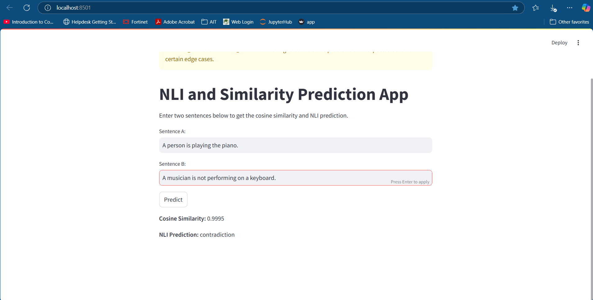
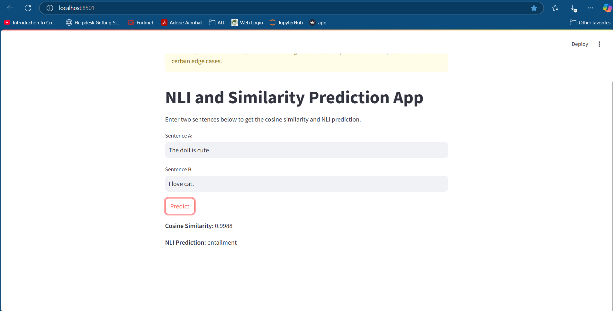
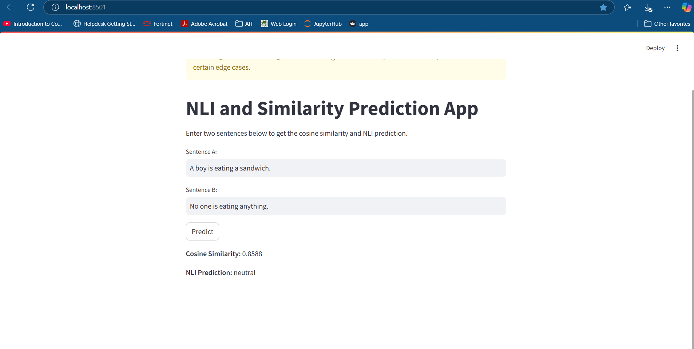

# NLP-A4: Do You Agree?
### **AT82.05 Artificial Intelligence: Natural Language Understanding (NLU)**

## **GitHub Repository**
🔗 [NLP-A4 GitHub Repo](https://github.com/phuepwint-thwe/NLP_A4_Final)

---

## **Contents**
- [Student Information](#student-information)
- [Project Overview](#project-overview)
- [Files Structure](#files-structure)
- [Dataset](#dataset)
- [Model Training](#training)
- [Evaluation & Results](#evaluation)
- [Web Application](#application)
- [Sample Test Cases](#sample-test-cases)
- [Screenshots from the Web Application](#screenshots-from-the-Web-Application)
- [Future Development](#furture-development)
- [Conclusion & Takeaways](#conclusion-and-takeways)

---

## **Student Information**
- **Name**: Phue Pwint Thwe  
- **ID**: st124784  

---

## **Project Overview**
This project implements **S-BERT (Sentence-BERT)** for **Natural Language Inference (NLI) & Semantic Text Similarity**.  
It compares **scratch-trained vs. pretrained models** to analyze performance differences.

The project includes:
- Training S-BERT from scratch  
- Fine-tuning a pretrained S-BERT model  
- Evaluating cosine similarity & accuracy  
- Deploying a **Streamlit web app** for real-time predictions  

---

## **Files Structure**
**Jupyter Notebooks**  
- `A4_Sentence_Bert.ipynb` → S-BERT (Scratch) Training  
- `A4_S-Bert(Pretrained).ipynb` → Fine-tuning Pretrained S-BERT  

**Web App**  
- `app.py` → Streamlit app for testing sentence similarity & NLI  

---

## **Dataset**
This project uses **100,000 samples** from the **BookCorpus dataset**, a large-scale text corpus commonly used for training language models.  

**Dataset Source**: [Hugging Face - BookCorpus](https://huggingface.co/datasets/bookcorpus/bookcorpus)  

---

## **Training Configuration**
### **Hyperparameters**
| Parameter             | Value   |
|-----------------------|---------|
| Vocab Size            | 23,069  |
| Batch Size            | 4       |
| Epochs                | 100     |
| Layers (n_layers)     | 6       |
| Heads (n_heads)       | 8       |
| Model Dim(d_model)    | 768     |
| Feedforward Dim (d_ff)| 768 * 4 |
| Segments (n_segments) | 2       |
| Max Mask Tokens       | 5       |

---

## **Evaluation & Results**
| Model Type        | Training Loss | Avg Cosine Similarity | Accuracy |
|-------------------|--------------|----------------------|----------|
| **S-BERT (Scratch)**  | 3.8988       | 0.9994               | 38.00%   |
| **S-BERT (Pretrained)** | 1.1251       | 0.7666               | **-**    |

**Key Observations**:
- **Scratch model overfitted**, as seen by the **high similarity score (0.9994)**.
- **Pretrained model generalizes better**, with a similarity score closer to expected results.
- **Training loss in the pretrained model is significantly lower**, confirming transfer learning benefits.

---

## **Web Application**
The **Streamlit app** allows users to enter two sentences and get:
**Cosine Similarity**  and **Natural Language Inference (NLI) Classification**  

### **Run the App Locally**
- streamlit run app.py

## **Sample Test Cases**  
The model classifies sentence relationships into:  

**Entailment** → Sentence B logically follows from Sentence A.  
**Contradiction** → Sentence B directly opposes Sentence A.  
**Neutral** → No clear relationship between the two sentences.  

### **Screenshots from the Web Application**  
#### **1️.Contradiction Example**  
**Sentence A**: A person is playing the piano.  
**Sentence B**: A musician is not performing on a keyboard.  
  

#### **2️.Entailment Example**  
**Sentence A**: The doll is cute.  
**Sentence B**: I love cats.  
  

#### **3️.Neutral Example**  
**Sentence A**: A boy is eating a sandwich.  
**Sentence B**: No one is eating anything.  
  

---

## **Future Development** 
- Improve training data quality to reduce overfitting in scratch training.  
- Experiment with **different transformer architectures** (e.g., RoBERTa, ALBERT).  
- Extend the app to **support multiple languages** for cross-lingual sentence similarity.  
- Optimize the **app’s performance** for large-scale datasets.  

---

## **Conclusion & Takeaways** 
**S-BERT (pretrained) is more reliable** than a scratch-trained model for generalizing sentence relationships.  
**Fine-tuning pretrained models saves training time** and improves accuracy.  
**The web app is functional and successfully predicts similarity & inference** with real-time input.  

**This project provides a strong foundation for further NLI and sentence similarity research!**  
---
